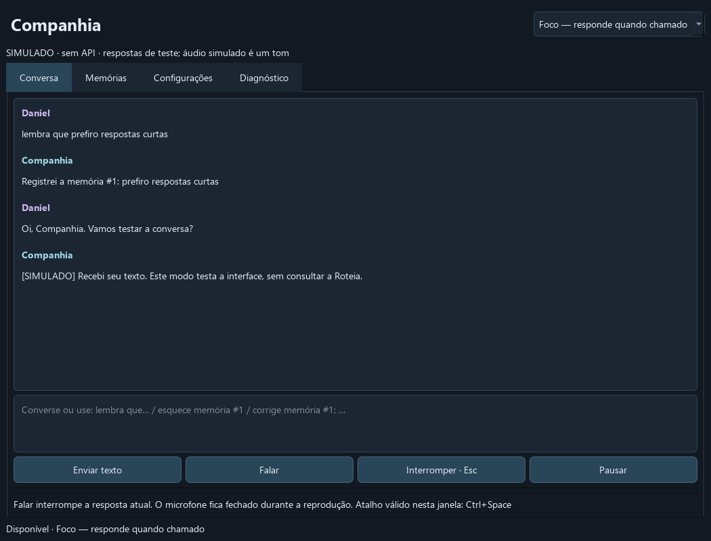

# Companhia

Assistente desktop para Windows, em português brasileiro, criada a partir de
`prompt_codex_assistente_voz_mvp.md`. Chat com streaming pela Roteia, memória local
SQLite, gravação por turnos, transcrição por API, cancelamento e modo Companhia.

**Etapa 2:** pergunta atual garantida no contexto, proatividade corrigida, tom
reversível, IDs persistentes migrados e adaptador específico de voz Roteia.
O schema de áudio é fundamentado na documentação upstream, como **hipótese de
compatibilidade**, e só é habilitado para conversa após uma amostra explícita
validada no gateway. Não se confirma compatibilidade por testes simulados.
A voz do Windows continua alternativa local. A experiência completa de voz
ainda exige o roteiro manual. Veja [contratos](docs/contratos.md)
e [validação](docs/validacao.md).

**Etapa 3 — a voz funciona.** A saída de voz passou para a **ElevenLabs**, em
pt-BR, com audição confirmada em conversa real. A Roteia segue responsável pelo
chat de texto e pela transcrição.

Motivo da troca: quatro amostras autenticadas na Roteia nunca entregaram áudio.
A rota `openai/gpt-audio-mini` falha em toda configuração, inclusive no exemplo
mínimo publicado por eles, enquanto um controle com `deepseek/deepseek-v4-flash`
responde HTTP 200 — logo a chave e o saldo estão bons e o modelo é que não
atende. O adaptador de voz da Roteia foi **preservado** e está correto conforme a
especificação upstream (`stream: true` + `pcm16`); volta a ser utilizável se a
rota deles for consertada. Evidência completa, decisões e pendências em
[voz ElevenLabs](docs/voz-elevenlabs.md).



## Instalar e iniciar no PowerShell

O ambiente deste projeto já tem `uv`, Python 3.12.13 e as dependências instaladas.
Para reproduzir a instalação, use o `uv` da [documentação oficial](https://docs.astral.sh/uv/getting-started/installation/):

```powershell
Set-Location C:\Users\danie\avatar-ia
uv python install 3.12
uv sync --locked
uv run companhia
```

O aplicativo começa em **Foco**, com voz desligada. Não faz chamadas de API ao
abrir. Para testar sem API, independentemente da chave configurada:

```powershell
uv run companhia --mock
```

As respostas desse modo são marcadas **SIMULADO**, não avaliam personalidade nem
qualidade dos modelos. Se ativar voz API simulada, o som é um tom de teste, não fala.

Sem `uv` após a instalação, o executável também pode ser iniciado diretamente:

```powershell
.\.venv\Scripts\companhia.exe
```

## Chave e configuração

A chave solicitada foi salva no `.env` da raiz, ignorado pelo Git. Não copie o
arquivo para documentação ou commits. Em uma nova instalação, crie-o somente se
ainda não existir:

```powershell
if (-not (Test-Path -LiteralPath .env)) {
    Copy-Item -LiteralPath .env.example -Destination .env
}
notepad .env
```

Preencha `ROTEIA_API_KEY` localmente. A prioridade é: variável de ambiente,
`.env` na raiz do projeto, chave salva pela interface em `api-key.txt` na pasta
de dados. A chave salva pela interface só é usada se ambiente/`.env` estiverem
vazios. O `.env` é encontrado pelo caminho do projeto, não pelo diretório atual
do terminal. O empacotamento em executável fica no backlog.

Na aba **Configurações**, escolha modelos, nome, personalidade, timeout,
microfone/saída, taxa, duração máxima, atalho e limites. Salve antes de testar;
interrompa um turno em andamento antes de salvar. O padrão de chat é
`deepseek/deepseek-v4-flash`, selecionado pela disponibilidade e streaming
declarados, como ponto inicial para diálogo curto, sem alegação de melhor qualidade.

Dados ficam em `%LOCALAPPDATA%\Companhia`, neste ambiente:
`C:\Users\danie\AppData\Local\Companhia`. Contém `config.json`,
`personality.md`, `companhia.sqlite3` e, se informada pela GUI, `api-key.txt`.
Personalidade pode ser alterada diretamente no arquivo, sem mudar código.
O modelo lê esse arquivo a cada turno. O SQLite contém conteúdo pessoal em texto
local; não há banco remoto, embeddings, captura de tela nem processamento na GPU.

Instalações existentes mantêm sua personalidade. Use **Revisar padrão atualizado
de personalidade** para ler/aplicar o novo padrão, com cópias do arquivo anterior
e de um rascunho não salvo. **Tom pedido por você** permite voltar ao normal nas
configurações; `menos zoeira` e `pode voltar a me zoar` também ajustam o tom entre
sessões, sem classificar opiniões como `não gostei desse filme` como feedback.

Para isolar uma instalação de teste, defina um caminho absoluto antes de iniciar:

```powershell
$env:COMPANHIA_DATA_DIR = 'C:\Users\danie\AppData\Local\Companhia-Teste'
uv run companhia --mock
```

## Conversar e usar voz

1. Envie texto para conversar, mesmo sem áudio disponível.
2. Em Configurações, atualize dispositivos e selecione microfone e saída. Evite
   **Mixagem estéreo** como entrada. Teste captura e saída localmente; são testes
   sem API. O teste de microfone captura três segundos e descarta a gravação.
3. Para experimentar voz local, selecione **Windows · local / alternativa** e
   salve. É necessária uma voz pt-BR instalada compatível com `System.Speech`.
   Nome vazio tenta selecionar pt-BR; pode informar um nome exato instalado.
4. Clique **Falar** ou `Ctrl+Space` com a janela ativa. Clique outra vez para
   parar; a gravação também termina no limite configurado. A transcrição aparece
   como mensagem, seguida da resposta e, se habilitada, da voz.
5. Use **Interromper**/`Esc`, ou **Falar** durante uma resposta, para cancelá-la.
   Não há interrupção automática pela voz. O microfone não fica aberto durante
   a reprodução. Uma requisição já aceita ainda pode gerar cobrança.

A gravação é WAV PCM16 mono, com 16 kHz por padrão. Captura vazia, muito curta
ou com RMS abaixo de 0,002 é rejeitada antes do upload. É uma proteção simples,
não detecção automática de fala; fale perto do microfone ou ajuste o dispositivo.
Áudio fica em memória e é descartado. A alternativa do Windows usa arquivos
temporários removidos ao concluir/cancelar. Não há histórico de áudio bruto.

**Voz ElevenLabs (padrão em uso):** configure `ELEVENLABS_API_KEY` no `.env` e
selecione **ElevenLabs · pt-BR** na aba Configurações. Os campos extras aparecem
ao escolher essa opção: ID da voz, modelo e quatro controles de expressividade.

A configuração validada por audição:

| Campo | Valor |
|---|---|
| ID da voz | `4PNBmCCUBwRktp7B7R1y` (Larissa, pt-BR) |
| Modelo | `eleven_v4_turbo` (custo 0.5x, menor latência) |
| Estabilidade | 0.3 — **baixa dá variação emocional; alta soa robótica** |
| Estilo | 0.4 |
| Semelhança | 0.8 |

Se a voz soar mecânica, baixe a estabilidade para 0.2 ou suba o estilo para 0.5
pela interface, sem mexer em código. Para trocar de voz, há três alternativas
pt-BR já na conta: `ptbr-Bea-acolhedora`, `ptbr-Beatriz-calorosa` e
`ptbr-Larissa-brincalhona`. Latência medida: 1,23 a 1,61 s para 72 caracteres.
O formato é MP3 44,1 kHz, que não exige plano pago específico e é decodificado
localmente, então a reprodução não precisou de alteração. Detalhes e armadilhas
da API em [voz ElevenLabs](docs/voz-elevenlabs.md).

**Voz Roteia (bloqueada; rota indisponível no gateway):** salve o modelo `openai/gpt-audio-mini` e a voz `alloy` (ou vazio,
que usa alloy), depois execute **Testar voz Roteia · uma amostra** na aba
Diagnóstico, ou o comando abaixo. Uma amostra por execução, sem retry; pode gerar
cobrança. A hipótese usa `chat/completions`, nunca `/audio/speech`. Não precisa
preencher caminhos internos de JSON. Sem validação, a conversa preserva texto
e avisa; não troca para Windows automaticamente.
Quando a rota retorna texto e fala juntos, o texto associado à fala substitui a
prévia no chat e no banco, preservando a correspondência.

Uma amostra válida registra `audio-validation.json` na pasta de dados, com
modelo, URL, voz e WAV observados. Mudar esses campos exige outra amostra. Esse
registro comprova apenas resposta técnica decodificável e texto associado;
naturalidade, fidelidade e audição precisam da sua avaliação.

## Memórias

Registro explícito, sem extração automática de fatos:

```text
lembra que prefiro respostas curtas
corrige memória #1: prefiro respostas curtas só quando estou jogando
esquece memória #2
```

Consulte os IDs, conteúdo, origem e data na aba **Memórias**. Também é possível
adicionar, corrigir e excluir pela interface. Busca textual ambígua para esquecer
não exclui nada; use o ID.

Correção desativa a versão anterior e cria uma ativa. Exclusão remove o registro
selecionado. Ambas invalidam o resumo e estabelecem uma barreira: mensagens
anteriores à alteração permanecem consultáveis, mas não são reenviadas ao modelo.
Não existe extração automática que possa recriar memórias a partir delas.
**Apagar histórico** remove mensagens e resumo, mantendo memórias duradouras e
seus registros de origem. Se a mensagem original for apagada, o ID de origem
continua sendo uma referência histórica, não uma mensagem ainda consultável.
Os IDs não são reutilizados. A primeira abertura do esquema antigo cria uma
cópia `.before-v2.bak` e migra as tabelas transacionalmente, preservando dados.
Origens apagadas aparecem como **mensagem removida**, sem apontar para texto novo.
O descarte conservador de tópicos anteriores ainda existe; a proposta para
preservar assuntos independentes está em [memória e revisões](docs/memoria-revisoes.md).

O contexto usa personalidade, até cinco memórias, trecho extrativo de até 2.000
caracteres e até 12 mensagens recentes completas, incluindo a pergunta atual,
com teto inicial de 18.000 caracteres. A pergunta tem prioridade; memórias e
resumo são reduzidos quando necessário. Respostas interrompidas/incompletas não entram
como respostas completas no contexto.

## Companhia, Foco e Pausado

**Foco** responde quando chamado. **Companhia** precisa ser ativado na janela;
espera 90 segundos após atividade, ao menos cinco minutos entre iniciativas,
no máximo quatro solicitações por hora e uma sem resposta. A decisão de ficar
em silêncio também ocupa uma tentativa para cooldown/limite, mas permite outra
após o intervalo: só texto efetivamente publicado aguarda resposta. Erro e
cancelamento antes da publicação também não criam espera indefinida.
Só funciona com assunto registrado, sem gravação, geração, reprodução ou edição.
A prioridade é sempre do usuário, com revalidação antes de publicar/falar.
Rascunhos e os cinco segundos após digitação bloqueiam iniciativas; foco parado
em editor vazio não bloqueia para sempre. Memórias, configurações e diálogos
relevantes mantêm o bloqueio durante edição.

**Pausado** interrompe o turno e impede novas gravações e chamadas. Ao reabrir,
o aplicativo volta a Foco. O comando textual `fica em silêncio` muda para Foco
localmente. Proatividade funciona somente enquanto a janela estiver aberta.

## Diagnóstico e testes

Diagnóstico local, sem chamadas ao gateway:

```powershell
uv run companhia diagnostico
uv run pytest -q
uv run ruff check src tests
uv lock --check
```

Testes bloqueiam HTTP real mesmo com uma chave no `.env`.
A aba Diagnóstico mostra modelos solicitado/retornado, estado, uso informado e
tempos medidos de transcrição, primeiro texto, geração, síntese, início local da
reprodução e fim da gravação até voz.
Ausência de medição significa que aquela etapa não foi medida. Não há promessa
de latência. Erros são apresentados sem corpo bruto do provedor ou autorização.

Para realizar uma chamada real curta, escolha a amostra explicitamente. Pode
gerar cobrança. Estes comandos **não foram executados automaticamente**:

```powershell
uv run companhia diagnostico --real --text 'Responda em uma frase: olá, Companhia.'
uv run companhia diagnostico --real --wav 'C:\caminho\amostra-curta.wav'
# Uma amostra explícita para testar a hipótese upstream; toca a voz para comparar:
uv run companhia diagnostico --real --probe-audio --voice alloy --speech-text 'Olá, Daniel. Esta é uma amostra curta.'
# Após essa configuração ter sido validada, usa o contrato observado:
uv run companhia diagnostico --real --voice alloy --speech-text 'Olá, Daniel.'
# Controles que isolam a causa de uma falha de voz na Roteia, uma amostra por execução:
uv run companhia diagnostico --real --probe-stream-text
uv run companhia diagnostico --real --probe-stream-text --no-stream
uv run companhia diagnostico --real --probe-stream-text --no-stream --probe-model deepseek/deepseek-v4-flash
```

Acrescente `--no-play` para validar sem reproduzir; o áudio é descartado. O texto
associado aparece apenas para comparação, sem entrar no histórico/ledger da amostra.
Não há síntese por frase nem streaming de áudio nesta entrega: aguardamos medições
reais antes de alterar latência ou quantidade de chamadas. Testes simulados não
justificam esse aumento de consumo.

O diagnóstico de chat desliga voz para consumir só uma chamada. A amostra WAV
deve conter fala, ter até 30 segundos e até 25 MB. Na interface, o teste real de
texto usa a configuração de voz selecionada e poderá gerar também síntese.

Os limites diários (dia UTC) contam tentativas de API, inclusive erros e
cancelamentos, e tokens informados. Voz Windows e modo simulado não consomem a
cota do gateway. O limite de tokens bloqueia **a próxima chamada** após atingir
o valor; não limita tokens de uma resposta em andamento, nem mede uso ausente.
Não há teto financeiro exato ou recarga automática. Custo desconhecido aparece
como desconhecido, nunca zero. Não há retry automático nem troca de modelo.

## Problemas comuns

- **Python abre a Microsoft Store:** use `uv run` ou o executável da `.venv`.
- **Microfone falha:** Windows → Privacidade e segurança → Microfone → permita
  aplicativos desktop; escolha outro dispositivo/taxa e salve. A janela e chat
  textual continuam disponíveis.
- **Não há voz:** a opção inicial é Desligada. Para a alternativa Windows,
  instale uma voz pt-BR compatível com a síntese desktop; vozes OneCore nem
  sempre aparecem em `System.Speech`. Não há fallback silencioso.
- **401 / 402 / 429:** revise chave, saldo ou limite no painel da Roteia.
  Na ElevenLabs, 401 indica `ELEVENLABS_API_KEY` ausente ou inválida.
- **Voz da Roteia falha:** rode os controles `--probe-stream-text` acima antes de
  supor causa. Eles distinguem schema recusado, streaming quebrado, rota do
  modelo indisponível e problema de conta. A mensagem do gateway aparece em
  `gateway_detail`, sem chave nem conteúdo sensível.
  O app não faz novas tentativas por conta própria.
- **Modelo incompatível/sem streaming:** copie um ID atual do catálogo e confira
  capacidades. Nenhum modelo é substituído automaticamente.
- **Configuração inválida:** a janela carrega padrões e avisa; o arquivo é
  preservado até você salvar. Falha de rede não impede abertura.

Siga o [roteiro manual](docs/teste-manual.md) antes de considerar a experiência de
voz validada. Próximas etapas estão no [backlog](docs/backlog.md).
